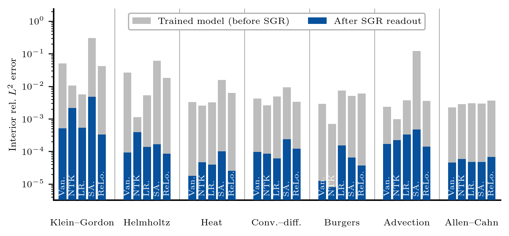

# A spectral-gap readout for loss weighting in physics-informed neural networks

Reference implementation of the spectral-gap readout (SGR), a post-processing
method that recomputes the last layer of a trained PINN at a weight selected
from the trained features alone. SGR never uses the exact solution, needs no
retraining, and applies on top of whichever rule set the weights during
training.



Interior relative L2 error of five weighting rules on seven PDEs, before (grey)
and after (blue) SGR, mean over five seeds.

## Layout

```
release/
  src/
    pdes.py        seven benchmarks: operators, manufactured solutions, sampling
    model.py       tanh MLP and the differentiable PINN fields it induces
    weighting.py   the five weighting rules, each following its authors'
                   released code, and the NTK trace they are built on
    train.py       training loop plus the readout, one (pde, rule, seed) per call
    sgr.py         the readout: frozen features, velocity dip, golden section,
                   last-layer solve
  experiments/
    run.py         one run -> results/runs/*.json
    reproduce.sh   the full sweep: 7 PDEs x 5 rules x 5 seeds
  figures/
    multipde.py    error before and after the readout, all benchmarks and rules
    fields.py      per-benchmark solution, prediction, and error fields
results/
  runs/            one json per (pde, rule, seed): errors, selected weight
  fields/          solution fields for the seed-1 runs
```

Scripts locate themselves, so they can be run from anywhere; paths resolve
against the repository root.

## Requirements

Python 3.10 or newer with `jax` (a CUDA build for the sweeps), `optax`,
`numpy`, `scipy` and `matplotlib`. `requirements.txt` pins the versions this
release was run and verified on. The figure scripts render text with LaTeX, so
they need `latex` and `dvipng` on the path.

```bash
pip install -r requirements.txt
```

## Running

A single configuration:

```bash
python release/experiments/run.py --pde helmholtz --method vanilla --seed 0
```

The full comparison, sharded over GPUs (`JOBS` runs share one device, finished
runs are skipped, so an interrupted sweep resumes):

```bash
GPUS="0,1,2" JOBS=4 bash release/experiments/reproduce.sh
```

The figures, from the saved runs in `results/` and without any training:

```bash
python release/figures/multipde.py
python release/figures/fields.py
```

Runs are reproducible across processes and machines of the same architecture:
the entry points set `--xla_gpu_deterministic_ops=true` and full `float32`
matmul precision before importing JAX, which removes the autotuning-dependent
reduction orders that otherwise perturb the low-order bits.

## What is here

`results/` holds the runs behind the paper's main comparison, so the two figure
scripts reproduce their figures without a GPU. The analyses of the discussion
section, which read the frozen last-layer systems of every run, are not part of
this repository. Those systems are several gigabytes and are available from the
authors on request.

## Benchmarks

All seven are posed on the unit square with a manufactured solution. The forcing
is obtained by applying the operator to that solution by automatic
differentiation and the condition data are its exact traces, so it solves each
problem by construction and the weight between the residual and the condition
terms is the only quantity varied.

| name                 | operator                  | manufactured solution                            | parameters         |
|----------------------|---------------------------|--------------------------------------------------|--------------------|
| klein_gordon         | u_tt - u_xx + u^3         | x cos(5 pi t) + (t x)^3                          | -                  |
| helmholtz (steady)   | u_xx + u_yy + u           | sin(pi x) sin(4 pi y)                            | modes (1, 4)       |
| heat                 | u_t - alpha u_xx          | e^{-t} (sin(pi x) + 0.3 sin(6 pi x))             | alpha = 0.1        |
| convection_diffusion | u_t + c u_x - nu u_xx     | e^{-t/2} sin(2 pi x) + 0.3 sin(5 pi x) cos(pi t) | c = 1.5, nu = 0.05 |
| burgers              | u_t + u u_x - nu u_xx     | e^{-t} (sin(2 pi x) + 0.5 sin(pi x))             | nu = 0.01 / pi     |
| advection            | u_t + c u_x               | sin(2 pi x) cos(2 pi t) + 0.3 e^{-t} sin(4 pi x) | c = 1              |
| allen_cahn           | u_t - eps u_xx + 5(u^3-u) | e^{-t} sin(pi x)                                 | eps = 1e-4         |

Coefficients follow the reference benchmarks of the adaptive-weighting
literature, but the problems are manufactured rather than the original
shock-forming and metastable ones, and the Helmholtz modes sit on the unit
square rather than on the larger domain of the reference.

## Weighting rules

`vanilla` is the unweighted sum. The other four each follow the released
implementation of their reference, including the update cadence and the
ordering relative to the Adam step.

| flag        | rule                       | reference                    |
|-------------|----------------------------|------------------------------|
| `vanilla`   | unweighted sum             | -                            |
| `ntk_trace` | NTK trace ratio            | Wang, Yu and Perdikaris 2022 |
| `lr_anneal` | learning-rate annealing    | Wang, Teng and Perdikaris 2021 |
| `sa_pinn`   | self-adaptive weights      | McClenny and Braga-Neto 2023 |
| `relobralo` | relative loss balancing    | Bischof and Kraus 2025       |

Two conventions are imposed on all of them so the comparison isolates the
weighting signal. Each condition group enters the loss as one mean over its
concatenated edges, and every rule is read in the same three-group split of
residual, initial and boundary terms.

## Citation

```bibtex
@article{hwang2026sgr,
  title  = {A spectral-gap readout for loss weighting in physics-informed neural networks},
  author = {Hwang, Mikyung and Choi, Minseok},
  year   = {2026}
}
```

## License

MIT, see `LICENSE`.
